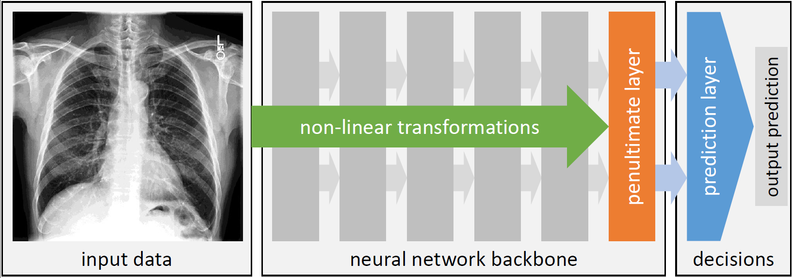

# Algorithmic encoding of protected characteristics in chest X-ray disease detection models



This repository contains the code for the paper
> B. Glocker, C. Jones, M. Bernhardt, S. Winzeck  
> [**Algorithmic encoding of protected characteristics in chest X-ray disease detection models**](https://www.thelancet.com/journals/ebiom/article/PIIS2352-3964(23)00032-4/fulltext)  
> eBioMedicine. Volume 89, 104467, March 2023.

## Dataset

The CheXpert imaging dataset together with the patient demographic information used in this work can be downloaded from https://stanfordmlgroup.github.io/competitions/chexpert/.

The MIMIC-CXR imaging dataset can be downloaded from https://physionet.org/content/mimic-cxr-jpg/2.0.0/ with the corresponding demographic information available from https://physionet.org/content/mimiciv/1.0/.

## Code

For running the code, we recommend setting up a dedicated Python environment.

### Setup Python environment using conda

Create and activate a Python 3 conda environment:

   ```shell
   conda create -n chexploration python=3
   conda activate chexploration
   ```
   
Install PyTorch using conda (for CUDA Toolkit 11.3):
   
   ```shell
   conda install pytorch torchvision cudatoolkit=11.3 -c pytorch
   ```
   
### Setup Python environment using virtualenv

Create and activate a Python 3 virtual environment:

   ```shell
   virtualenv -p python3 <path_to_envs>/chexploration
   source <path_to_envs>/chexploration/bin/activate
   ```
   
Install PyTorch using pip:
   
   ```shell
   pip install torch torchvision
   ```
   
### Install additional Python packages:
   
   ```shell
   pip install matplotlib jupyter pandas seaborn pytorch-lightning scikit-learn scikit-image tensorboard tqdm openpyxl tabulate statsmodels
   ```

### Requirements

The code has been tested on Windows 10 and Ubuntu 18.04/20.04 operating systems. The data analysis does not require any specific hardware and can be run on standard laptop computers. The training and testing of the disease detection models requires a high-end GPU workstation. For our experiments, we used a NVIDIA Titan X RTX 24 GB.

### How to use

In order to replicate the results presented in the paper, please follow these steps:

1. Download the [CheXpert dataset](https://stanfordmlgroup.github.io/competitions/chexpert/), copy the file `train.csv` to the `datafiles/chexpert` folder. Download the [CheXpert demographics data](https://stanfordaimi.azurewebsites.net/datasets/192ada7c-4d43-466e-b8bb-b81992bb80cf), copy the file `CHEXPERT DEMO.xlsx` to the `datafiles/chexpert` folder.
2. Download the [MIMIC-CXR dataset](https://physionet.org/content/mimic-cxr-jpg/2.0.0/), copy the files `mimic-cxr-2.0.0-metdata.csv` and `mimic-cxr-2.0.0-chexpert.csv` to the `datafiles/mimic` folder. Download the [MIMIC-IV demographics data](https://physionet.org/content/mimiciv/1.0/), copy the files `admissions.csv` and `patients.csv` to the `datafiles/mimic` folder.
3. Run the notebooks [`chexpert.sample.ipynb`](notebooks/chexpert.sample.ipynb) and [`mimic.sample.ipynb`](notebooks/mimic.sample.ipynb) to generate the study data.
4. Run the notebook [`chexpert.resample.ipynb`](notebooks/chexpert.resample.ipynb) to perform test-set resampling.

To replicate the results on CheXpert:

1. Adjust the variable `img_data_dir` to point to the CheXpert imaging data and run the following scripts:
   - Run the script [`chexpert.disease.py`](prediction/chexpert.disease.py) to train a disease detection model.
   - Run the script [`chexpert.sex.py`](prediction/chexpert.sex.py) to train a sex classification model.
   - Run the script [`chexpert.race.py`](prediction/chexpert.race.py) to train a race classification model.
   - Run the script [`chexpert.multitask.py`](prediction/chexpert.multitask.py) to train a multitask model.
2. Run the notebook [`chexpert.predictions.ipynb`](notebooks/chexpert.predictions.ipynb) to evaluate all the prediction models.
3. Run the notebook [`chexpert.explorer.ipynb`](notebooks/chexpert.explorer.ipynb) for the unsupervised exploration of feature representations.

Additionally, there are scripts [`chexpert.sex.split.py`](prediction/chexpert.sex.split.py) and [`chexpert.race.split.py`](prediction/chexpert.race.split.py) to run SPLIT on the disease detection model. The default setting in all scripts is to train a DenseNet-121 using the training data from all patients. The results for models trained on subgroups only can be produced by changing the path to the data files (e.g., using `chexpert.sample.train.white.csv` and `chexpert.sample.val.white.csv` instead of `chexpert.sample.train.csv` and `chexpert.sample.val.csv`).

To replicate the results on MIMIC-CXR, adjust the above scripts accordingly to point to the MIMIC imaging data and its corresponding data files (e.g., `mimic.sample.train.csv`, `mimic.sample.val.csv` and `mimic.sample.test.csv`). 

Note, the Python scripts also contain code for running the experiments using a ResNet-34 backbone which requires less GPU memory than DenseNet-121.

### Trained models

All trained models, feature embeddings and output predictions [can be found here](https://imperialcollegelondon.box.com/s/bq87wkuzy14ctsyf8w3hcikwzu8386jj). These can be used to directly reproduce the results presented in our paper using the notebooks [`chexpert.predictions.ipynb`](notebooks/chexpert.predictions.ipynb) and [`chexpert.explorer.ipynb`](notebooks/chexpert.explorer.ipynb).

### Expected outputs and runtimes

The scripts for disease detection, sex classification, and race classification will produce outputs in csv format that can be processed by the evaluation code in the Jupyer notebooks. The notebooks will produce figures and plots either in png or pdf format.

Training the models for disease detection, sex classification, and race classification will take about three hours each on a high-end GPU workstation. Running the data analysis code provided in the notebooks takes several minutes on a standard laptop computer.
   
## Funding sources
This work is supported through funding from the European Research Council (ERC) under the European Union’s Horizon 2020 research and innovation programme (Grant Agreement No. 757173, [Project MIRA](https://www.project-mira.eu), ERC-2017-STG) and by the [UKRI London Medical Imaging & Artificial Intelligence Centre for Value Based Healthcare](https://www.aicentre.co.uk/).

## License
This project is licensed under the [Apache License 2.0](LICENSE).
